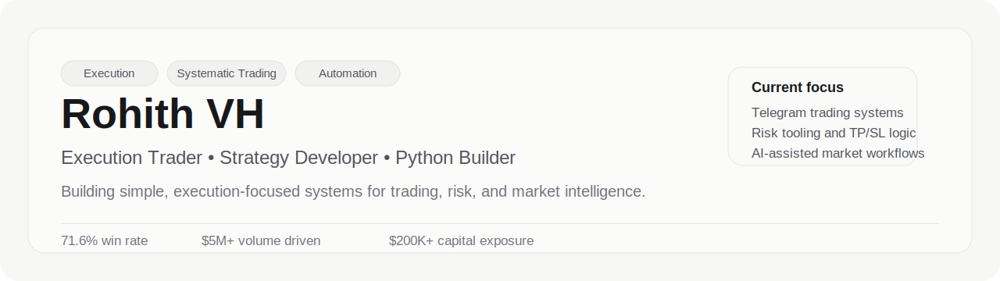

  

  <a href="https://www.rohithvh.info">website</a> ·
  <a href="https://www.linkedin.com/in/rohith-vh95">linkedin</a> ·
  <a href="https://t.me/babaearn23">telegram</a>

  I build product-driven trading systems, AI workflows, and execution tooling for live markets.

---

## About

I currently work at Mudrex, where I operate across trading, product execution, growth workflows, and automation. My background combines live market participation with Python systems for signal generation, risk management, reporting, and community operations.

My experience spans crypto futures, spot, leveraged products, funding-rate strategies, discretionary execution, systematic research, and AI-assisted product workflows using tools such as Codex, Claude Code, and agentic automation systems.

## Performance At A Glance

| Metric | Value | Context |
|---|---:|---|
| Documented Win Rate | 71.6% | Across 208 live trading signals |
| Trading Volume Driven | $5M+ | Futures volume from Telegram trading campaign |
| Capital Exposure | $200K+ | Self-directed trading across crypto, forex, and US indices |
| Market Experience | 6+ years | Live exposure across futures, spot, leveraged products, and derivatives |

## Featured Work

### Quantra-950 Intelligence Bot
AI-powered derivatives analysis bot built for live market data, sentiment workflows, and execution-focused product insights.

### Funding Rate Sniper Bot
Automation around perpetual funding events with timed entries, forced exits, and PnL-aware reporting.

### Bybit Risk Calculator Bot
Telegram-based TP/SL and position sizing tool for faster, cleaner execution decisions.

### Product and AI Workflow Systems
Internal-style workflows for research, reporting, agentic automation, and trading operations using Codex, Claude Code, and modern AI tooling.

## Stack

- Python
- CCXT
- Binance API
- Bybit API
- Telegram bots
- PostgreSQL
- TradingView
- Antigravity
- Codex
- Gemini
- Claude Code
- Claude

## Connect

- Website: https://www.rohithvh.info
- LinkedIn: https://www.linkedin.com/in/rohith-vh95
- Telegram: https://t.me/babaearn23

---

  <b>Open to collaborations in trading systems, automation, market intelligence, and execution tooling.</b>

